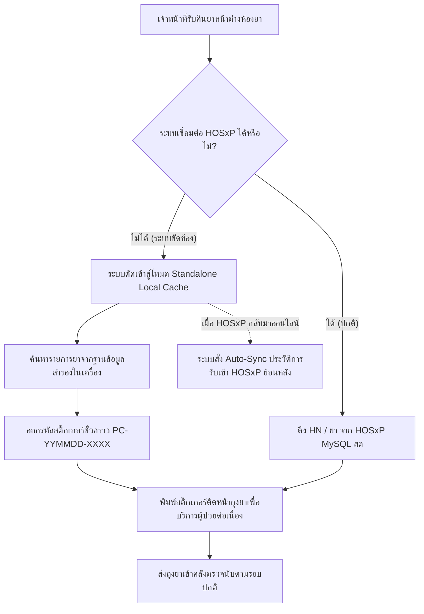

# แผนบริหารความต่อเนื่องในการดำเนินงาน (Business Continuity Plan - BCP)
## ระบบบริหารจัดการคลังยาบริจาค (Donated Medicine Manager)
### โรงพยาบาลสมเด็จพระยุพราชสายบุรี (รหัสหน่วยงาน: 10690)
**มาตรฐานการรับรองคุณภาพโรงพยาบาล (HA ฉบับที่ 6: มาตรฐานหมวดสารสนเทศและระบบยา II-4, II-5)**

---

## 1. วัตถุประสงค์และขอบเขต (Purpose & Scope)

แผนประคองกิจการฉบับนี้จัดทำขึ้นเพื่อให้การดำเนินงานรับคืนยา คัดแยก จัดเก็บ และโอนย้ายเวชภัณฑ์บริจาค ณ ห้องจ่ายยาผู้ป่วยนอก (OPD Pharmacy) และคลังยา สามารถดำเนินงานได้อย่างต่อเนื่อง ไม่หยุดชะงัก แม้ในภาวะที่ระบบสารสนเทศหลัก (HOSxP) ล่ม เครือข่ายเน็ตเวิร์กขาด หรือไฟฟ้าดับ

---

## 2. ระดับความรุนแรงและสถานการณ์วิกฤต (Threat Scenarios & Tiers)

| ระดับ | สถานการณ์ (Scenario) | ผลกระทบต่อระบบ | แนวทางปฏิบัติและโหมดทำงาน (Action Mode) |
| :---: | :--- | :--- | :--- |
| **ระดับ 1** | **ระบบเครือข่าย HOSxP ขัดข้อง** (สายแลนหลุด / สวิตช์เสีย / HOSxP DB ชะลอตัว) | Backend ไม่สามารถ query ค้นหา HN หรือรายการยาแบบสดจาก HOSxP ได้ | **สลับเข้าสู่โหมด Offline Fallback** อัตโนมัติ: ระบบจะใช้ข้อมูลยากลางและแคชผู้ป่วยในเครื่องเซิร์ฟเวอร์ห้องยาเพื่อพิมพ์สติ๊กเกอร์ความร้อนต่อไปได้ทันที |
| **ระดับ 2** | **เซิร์ฟเวอร์ห้องยานอกหยุดทำงาน** (Hardware Failure / OS Crash) | เครื่องลูกข่ายหน้าต่างห้องยาเข้า Web URL ไม่ได้ | **เปิดทำงาน Standalone Instance บน Client PC** สำรองประจำโต๊ะจ่ายยา โดยใช้ Docker Desktop หรือ Python Local Server ภายใน 5 นาที |
| **ระดับ 3** | **ไฟฟ้าดับทั้งอาคาร / UPS สำรองไฟหมด** | คอมพิวเตอร์และเครื่องพิมพ์ความร้อนไม่สามารถทำงานได้ | **สลับใช้แบบฟอร์มเอกสารกระดาษฉุกเฉิน (Emergency Manual Voucher)** โดยใช้สมุดรับมอบยาและเขียนรหัสฉลากชั่วคราว แล้วบันทึกย้อนหลัง (Backfill) เมื่อไฟฟ้ากลับมา |

---

## 3. แผนผังขั้นตอนการสลับโหมดการทำงาน (BCP Workflow)

---

## 4. มาตรการรองรับเชิงปฏิบัติการ (Operational SOPs)

### 4.1. โหมดระบบเครือข่ายขัดข้อง (Network Partition Mode)
1. เจ้าหน้าที่หน้าต่างจ่ายยาสามารถคีย์เลข HN และชื่อผู้ป่วยได้ด้วยตนเอง
2. ค้นหารายการยาจากฐานข้อมูลท้องถิ่นในเครื่องเซิร์ฟเวอร์ห้องยานอก (`donated_local_drugitems`) ที่ระบบซิงค์เก็บสำรองไว้ทุกเที่ยงคืน
3. สั่งพิมพ์สติ๊กเกอร์ความร้อน 8x5 ซม. ติดหน้าถุงยาให้ผู้ป่วยได้ตามปกติ
4. ข้อมูลจะถูกเก็บพักไว้ในคิวรอการตรวจสอบหลังบ้าน (Pending Reconciliation) โดยไม่สูญหาย

### 4.2. โหมดเครื่องเซิร์ฟเวอร์หลักชำรุด (Server Failover Mode)
1. นำเครื่องคอมพิวเตอร์ลูกข่ายที่หน้าต่างจ่ายยาเครื่องที่ 1 เป็นเซิร์ฟเวอร์สำรอง (Secondary Host)
2. ดับเบิ้ลคลิกไฟล์ `start_service.bat` บนเครื่องสำรอง
3. กู้คืนไฟล์ฐานข้อมูลล่าสุดจากโฟลเดอร์ Backup (ดูคู่มือ DRP)
4. แจ้งเครื่องลูกข่ายเครื่องอื่นเปลี่ยน IP การเข้าใช้งานไปยังเครื่องสำรอง

### 4.3. โหมดไฟฟ้าดับฉุกเฉิน (Paper Emergency Voucher)
1. ใช้แบบฟอร์ม **"ใบยินยอมส่งมอบเวชภัณฑ์บริจาคฉบับสำรองฉุกเฉิน"** (พิมพ์เตรียมไว้ในแฟ้มประจำห้องยา 50 ชุด)
2. เจ้าหน้าที่บันทึก: วันที่, เวลา, HN, ชื่อผู้ป่วย, รายการยาและจำนวนโดยประมาณ
3. ให้ผู้ป่วยลงนามยินยอม และใช้ปากกาเคมีเขียนรหัสถุงยาชั่วคราว เช่น `EM-260917-01`
4. เมื่อกระแสไฟฟ้ากลับสู่สภาวะปกติ เจ้าหน้าที่นำชุดเอกสารมาคีย์เข้าระบบย้อนหลัง (Backfill Entry) ภายใน 2 ชั่วโมง

---

## 5. บทบาทและหน้าที่ความรับผิดชอบ (Roles & Incident Response Matrix)

| บทบาทหน้าที่ | ผู้รับผิดชอบตามตำแหน่ง | การปฏิบัติการในภาวะ BCP |
| :--- | :--- | :--- |
| **ผู้อำนวยการสั่งการ BCP** | หัวหน้ากลุ่มงานเภสัชกรรม (ภญ.วันฮามีดะห์ ปานากาเซ็ง) | สั่งการสลับโหมด BCP, ประสานงานหัวหน้ากลุ่มงานสารสนเทศ (IT) |
| **ผู้ควบคุมระบบหน้างาน** | เภสัชกรคลังยาบริจาค (ภก.ยัสลัน มายุดิน) | ตรวจสอบสถานะการทำงานของ Local Server, แจ้งสลับใช้ระบบสำรอง |
| **ผู้ปฏิบัติการรับยา** | เจ้าพนักงานเภสัชกรรม (อัหลาม แคเม๊าะ) | ตรวจสอบถุงยา, ดำเนินการคัดกรองตาม SOP ฉุกเฉิน |
| **ฝ่ายสารสนเทศโรงพยาบาล** | ศูนย์คอมพิวเตอร์ / IT รพ.สมเด็จพระยุพราชสายบุรี | ตรวจสอบสายสัญญาณ, กู้คืนระบบเครือข่าย HOSxP และดาต้าเบส |
