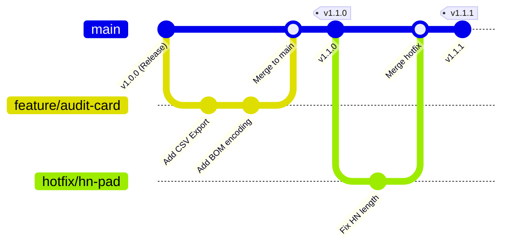

# แผนบริหารจัดการเวอร์ชันและการเปลี่ยนแปลงระบบ (Version Control Plan)
## ระบบบริหารจัดการคลังยาบริจาค (Donated Medicine Manager)
### โรงพยาบาลสมเด็จพระยุพราชสายบุรี

---

## 1. มาตรฐานการกำหนดหมายเลขเวอร์ชัน (Semantic Versioning 2.0.0)

ระบบใช้โครงสร้างหมายเลขเวอร์ชันในรูปแบบ **`MAJOR.MINOR.PATCH`** (เช่น `v1.2.0`):

- **MAJOR (เวอร์ชันหลัก)**: เมื่อมีการปรับเปลี่ยนสถาปัตยกรรมครั้งใหญ่ หรือมี Breaking Changes ที่กระทบโครงสร้างฐานข้อมูล HOSxP
- **MINOR (เวอร์ชันรอง)**: เมื่อมีการเพิ่มฟังก์ชันการทำงานใหม่ เช่น ระบบเชื่อมต่อตู้ยาอัตโนมัติ, รายงาน สตง. รูปแบบใหม่ (Backward Compatible)
- **PATCH (เวอร์ชันย่อย)**: เมื่อมีการแก้ไขบั๊ก, ปรับปรุงประสิทธิภาพ Query, หรือปรับแต่งหน้าตา UI เล็กน้อย

---

## 2. นโยบายการบริหารสาขาโค้ด (Git Branching Strategy)

ระบบใช้รูปแบบ **GitHub Flow / Trunk-Based Development** เพื่อความคล่องตัวและลดความซับซ้อน:



1. **`main` Branch**:
   - เป็นสาขาหลักที่มีความเสถียรสูงสุด (Production-ready code)
   - ทุก Commit บนสาขานี้จะต้องผ่านการตรวจสอบ Syntax และ Build Docker Images สำเร็จเสมอ
2. **`feature/*` Branches**:
   - แตกสาขาออกไปพัฒนาฟังก์ชันใหม่ และส่ง Pull Request กลับมายัง `main`
3. **`hotfix/*` Branches**:
   - แตกสาขาออกจาก `main` เมื่อพบบั๊กวิกฤตที่หน้าต่างห้องยา และรวมกลับเข้า `main` ทันทีพร้อมออก Patch Tag

---

## 3. นโยบายความปลอดภัยของฐานข้อมูลเมื่อเปลี่ยนเวอร์ชัน (Database Migration Safety)

ตามข้อกำหนด **Healthcare Resilient Architect Directive 9**:

1. **Expand and Contract Pattern**:
   - การปรับโครงสร้างตาราง (Schema Change) จะต้องเพิ่มคอลัมน์ใหม่พร้อมกำหนด Default Value ก่อนเสมอ
   - ห้ามสั่ง `DROP COLUMN` หรือ `RENAME COLUMN` ใน Transaction เดียวกับการ Deploy โค้ดเวอร์ชันใหม่
2. **Idempotent Migrations**:
   - สคริปต์ Migration ทุกตัวจะต้องสามารถรันซ้ำได้โดยไม่ก่อให้เกิด Error (เช่น ตรวจสอบ `IF NOT EXISTS` เสมอ)
3. **Rollback Playbook (แผนถอยกลับเวอร์ชันฉุกเฉิน)**:
   - หากการ Deploy เวอร์ชันใหม่มีปัญหา ให้ใช้คำสั่ง Git Rollback ได้ภายใน 3 นาที:
     ```bash
     # ดูประวัติ Commit ก่อนหน้า
     git log --oneline -n 5

     # สลับกลับไปยัง Commit หรือ Release Tag ที่เสถียร
     git checkout v1.0.0

     # สั่ง Rebuild Containers ด้วยโค้ดเวอร์ชันเดิม
     docker compose up --build -d
     ```

---

## 4. บันทึกประวัติการเปลี่ยนแปลง (Change Log Management)

ทุกการอัปเดตเวอร์ชันจะต้องบันทึกลงในไฟล์ `CHANGELOG.md` โดยแบ่งหมวดหมู่ดังนี้:
- `Added`: สำหรับความสามารถใหม่
- `Changed`: สำหรับการเปลี่ยนแปลงฟังก์ชันเดิม
- `Fixed`: สำหรับการแก้ไขบั๊ก
- `Security`: สำหรับการปรับปรุงความปลอดภัยและนโยบาย PDPA
